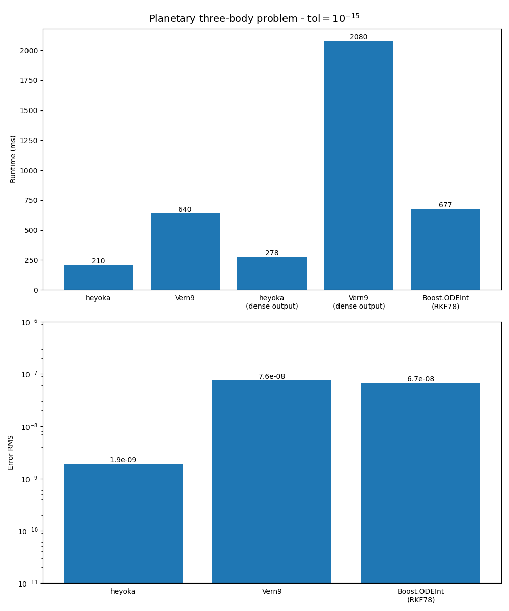
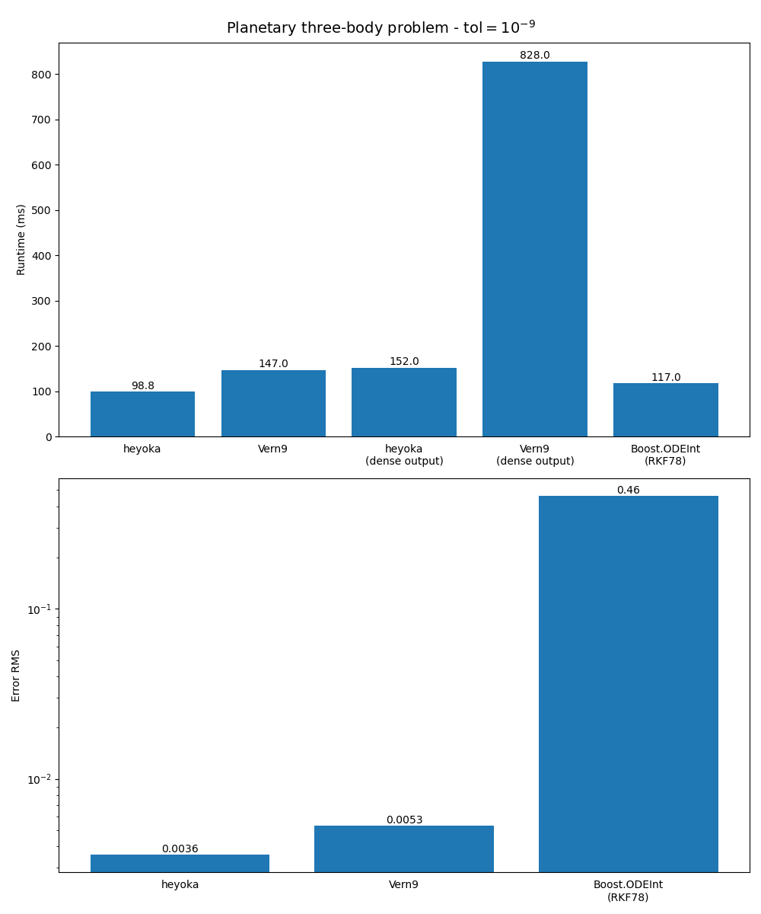
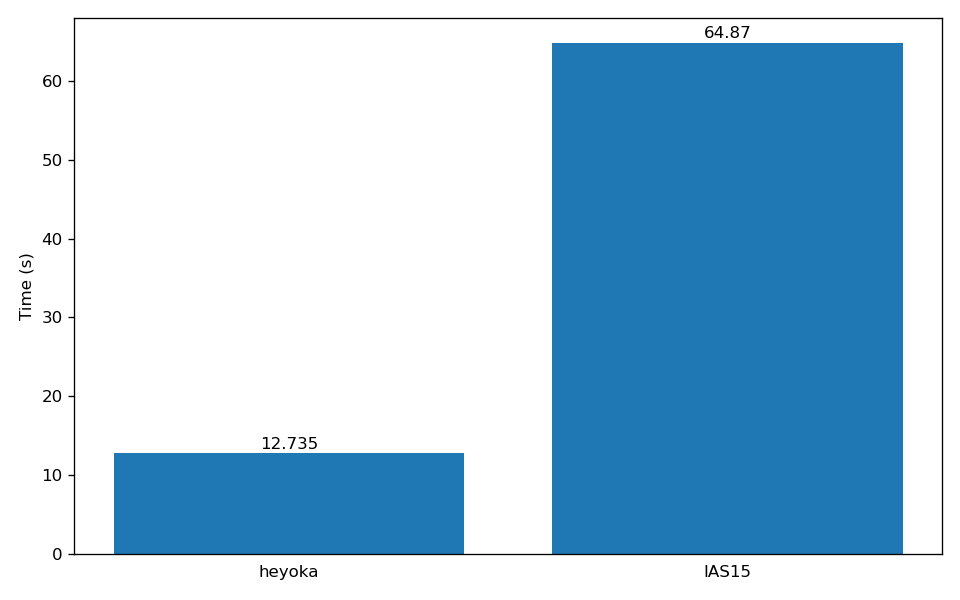
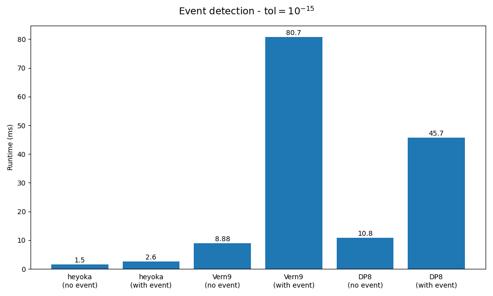

.. _benchmarks:

Benchmarks
==========

In this section we provide a few performance comparisons between heyoka and other popular
ODE integration packages. Specifically, we compare heyoka to:

- `DifferentialEquations.jl <https://diffeq.sciml.ai/>`__, a popular Julia
  library implementing several ODE solvers. In these benchmarks, we will be using
  explicit Runge-Kutta solvers such as ``Vern9`` and ``DP8`` (see
  `here <https://diffeq.sciml.ai/stable/solvers/ode_solve/>`__ for a list of
  ODE solvers available in DifferentialEquations.jl);
- `Boost.ODEInt <https://www.boost.org/doc/libs/master/libs/numeric/odeint/doc/html/index.html>`__,
  a C++ package implementing various algorithms for the solution of systems of ODEs. In these
  benchmarks, we will be using the explicit Runge-Kutta-Fehlberg 78 solver;
- the ``IAS15`` integrator from `REBOUND <https://github.com/hannorein/rebound>`__,
  a popular N-body integration package. Like heyoka, ``IAS15`` is a high-precision
  non-symplectic integrator with adaptive timestepping capable of conserving the
  dynamical invariants over billions of dynamical timescales. Note, however, that
  ``IAS15`` is not a general-purpose integrator, and thus we will be able to use
  it only in benchmarks involving gravitational N-body systems.

Note that the integrators from DifferentialEquations.jl by default
enable dense output, which however incurs in a heavy computational cost. While heyoka also supports
:ref:`dense output <tut_d_output>`, this feature is opt-in and its performance impact is much more limited.
In these benchmarks, we will be testing both with and without dense output.

All benchmarks were run on an Intel Xeon Platinum 8360Y CPU. More benchmark results are available in the
`heyoka paper <https://arxiv.org/abs/2105.00800>`__.
The benchmarks' source code is available in the `github repository <https://github.com/bluescarni/heyoka/tree/master/benchmark>`__.

The planetary three-body problem
--------------------------------

Here we will numerically integrate a specific case of the `three-body problem <https://en.wikipedia.org/wiki/Three-body_problem>`__
in which the three particles are the Sun, Jupiter and Saturn, all represented as point masses
attracting each other according to `Newtonian gravity <https://en.wikipedia.org/wiki/Newton%27s_law_of_universal_gravitation>`__.
The initial conditions are taken from `this paper <https://ntrs.nasa.gov/citations/19860060859>`__, and the integration
is run for a total of :math:`10^5` years.
For ``Vern9`` and heyoka, the test is run both with and without :ref:`dense output <tut_d_output>`. When dense output is enabled,
the result of the integration over :math:`5 \times 10^5` equispaced time grid points is requested.

In order to measure the accuracy of the integration, we will also compare the final state of the system
with the result of a numerical integration in quadruple precision with a tolerance of :math:`10^{-30}`.

Let us see first the results for an error tolerance of :math:`10^{-15}`:

We can see how, without dense output, heyoka is about 3 times faster than ``Vern9``. When dense output is requested,
heyoka's runtime increases by a modest :math:`\sim 24\%`, whereas for ``Vern9`` the runtime increases by a factor of
:math:`\sim 3`, so that, with dense output, heyoka is about :math:`\sim 7` times faster than ``Vern9``. Performance-wise,
Boost.ODEint is comparable to ``Vern9`` (note that the RKF78 integrator from Boost.ODEInt does not support dense output).

From the point of view of the integration accuracy, we can see how the RMS of the error across the components of the state
vector with respect to the quadruple-precision integration is of the order of :math:`10^{-9}` for heyoka, while for both
``Vern9`` and Boost.ODEInt the error is about :math:`\sim 35` times larger.

Note that, even if the error tolerance for the integration is set to :math:`10^{-15}`, the error at the end of the integration
is of the order of :math:`10^{-9}`. This is to be expected, as the error on the state variables accumulates as (at least)
:math:`t^{\frac{3}{2}}` (a result known as Brouwer's law).

Let us now see the results for an error tolerance of :math:`10^{-9}`:

Whereas heyoka is still faster than ``Vern9`` and Boost.ODEInt, at this higher integration tolerance the performance
advantage is smaller.

The integration accuracy of both heyoka and ``Vern9`` is of the order of :math:`10^{-3}`. By contrast,
the accuracy of Boost.ODEInt is two orders of magnitude worse.

The outer Solar System
----------------------

In this benchmark, we will integrate the motion of the outer Solar System for 1 million years. We define the outer Solar
System as the 6-body problem consisting of the Sun, Jupiter, Saturn, Uranus, Neptune and Pluto, all considered as point
masses attracting each other according to `Newtonian gravity <https://en.wikipedia.org/wiki/Newton%27s_law_of_universal_gravitation>`__.
The initial conditions are taken from `this paper <https://ntrs.nasa.gov/citations/19860060859>`__.

For this benchmark, we will be comparing heyoka to the ``IAS15`` integrator from `REBOUND <https://github.com/hannorein/rebound>`__.

Here are the results:

We can see how heyoka is about 5 times faster than ``IAS15`` in this specific test. A detailed performance comparison with ``IAS15``
is available in the `heyoka paper <https://arxiv.org/abs/2105.00800>`__.

Event detection
---------------

In this benchmark we measure the overhead of heyoka's :ref:`event detection <tut_events>` system and compare it to
the ``Vern9`` and ``DP8`` integrators from DifferentialEquations.jl.
We consider the dynamical system studied by Hénon and Heiles in a
`famous numerical experiment <https://ui.adsabs.harvard.edu/abs/1964AJ.....69...73H/abstract>`__ investigating
the existence of additional integrals of motion in axisymmetric potentials. The differential equations are:

.. math::

   \begin{cases}
   v_x^\prime &= -x-2xy \\
   v_y^\prime &= y^2-y-x^2 \\
   x^\prime &= v_x \\
   y^\prime &= v_y
   \end{cases},

with initial conditions

.. math::

   \begin{cases}
   v_x\left(0\right) &= -0.2525875586263492  \\
   v_y\left(0\right) &= -0.2178423952983717  \\
   x\left(0\right) &= 0  \\
   y\left(0\right) &=  0.2587703282931232 \\
   \end{cases}.

Our objective is to compute the `Poincaré section <https://en.wikipedia.org/wiki/Poincar%C3%A9_map>`__
of the solution on the :math:`\left( y,v_y \right)` plane. This can be accomplished by setting up the event equation

.. math::

   x = 0

to detect when the solution crosses the :math:`\left( y,v_y \right)` plane. Like in the original paper,
we impose the additional constraint that the event direction must be *positive* (i.e., we only detect
crossing of the plane from below). The total integration time is :math:`2000` time units and the tolerance
is set to :math:`10^{-15}`. For both heyoka and the DifferentialEquations.jl integrators, we measure the runtime
both with and without event detection.

Here are the results:

We can see how heyoka's event detection system has a much lower overhead than the event detection system in
DifferentialEquations.jl. heyoka's event detection system combines the free dense output from Taylor's method
with state-of-the-art polynomial root finding techniques to provide an event-detection methodology which is
both rigorous and computationally efficient. By contrast, DifferentialEquations.jl adopts the approach
of checking for sign changes in the event equation using the interpolant of the solution
within a timestep at discrete points. Note that
this approach is not rigorous, in the sense that if the event equation has two zeroes between the interpolation
points the event will be missed. By contrast, heyoka's approach does not suffer from this issue.
