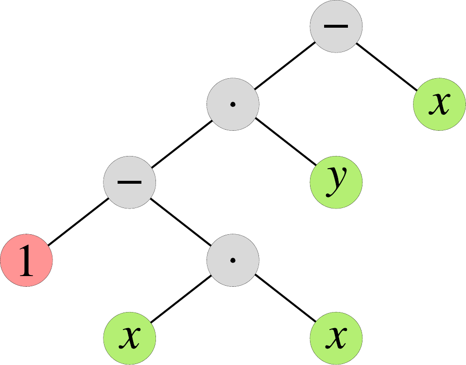

.. _tut_expression_system:

The expression system
=====================

As we saw in the :ref:`previous section <tut_taylor_method>`, heyoka
needs to be able to represent the righ-hand side of an ODE system in symbolic
form in order to be able to compute its high-order derivatives via automatic
differentiation. heyoka represents generic mathematical expressions
via a simple `abstract syntax tree (AST) <https://en.wikipedia.org/wiki/Abstract_syntax_tree>`__
in which the internal nodes are either mathematical operators or n-ary functions,
and the leaf nodes are either symbolic variables or numerical constants.

As a simple example, here is a graphical representation of the
AST for the expression :math:`\left( 1 - x^2\right)y-x`:

Thanks to the use of modern C++ features (user-defined literals, overloaded operators, etc.),
the construction of the AST of an expression in heyoka can be accomplished via natural
mathematical notation:

.. literalinclude:: ../tutorial/ex_system.cpp
   :language: c++
   :lines: 17-24

Numerical constants can be created using any of the floating-point types supported by heyoka:

.. literalinclude:: ../tutorial/ex_system.cpp
   :language: c++
   :lines: 26-34,36-37

Note that support for extended-precision floating-point types
:ref:`varies depending on the software/hardware platform <ep_support>`.

In addition to the standard mathematical operators, heyoka's expression system
also supports the following elementary functions (with more to come in the near future):

* sine and cosine,
* logarithm and exponential,
* exponentiation,
* square root.

It must be emphasised that heyoka's expression system is not a full-fledged
computer algebra system. In particular, its simplification capabilities
are very limited. Because heyoka's performance is sensitive
to the complexity of the ODEs, in order to achieve optimal performance
it is important to ensure that
the mathematical expressions supplied to heyoka are simplified as
much as possible.

Full code listing
-----------------

.. literalinclude:: ../tutorial/ex_system.cpp
   :language: c++
   :lines: 9-
